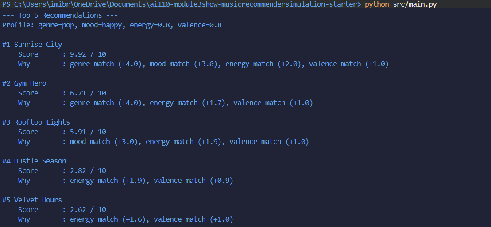
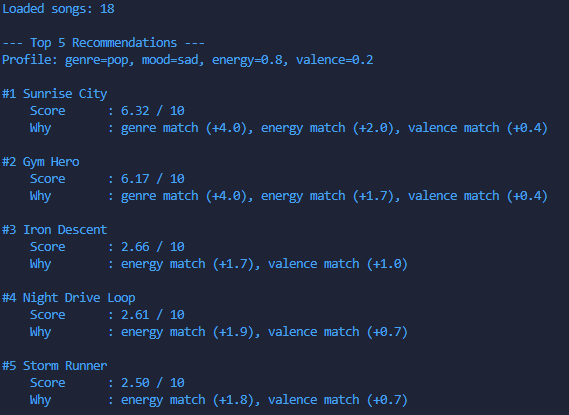
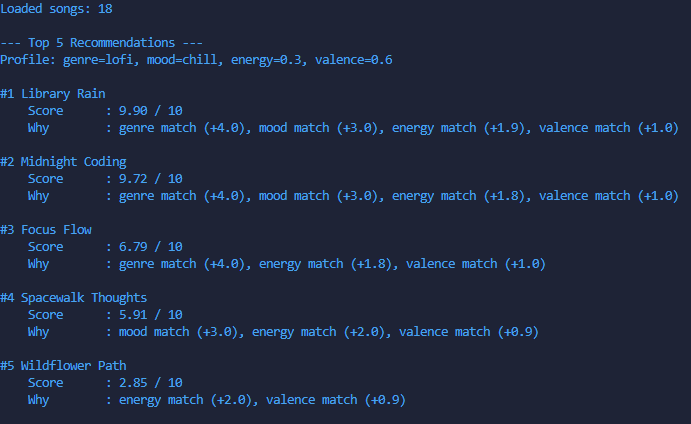
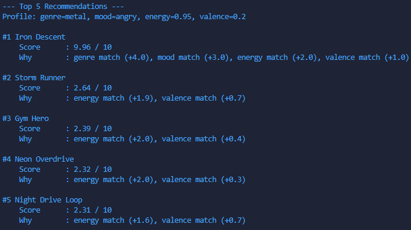
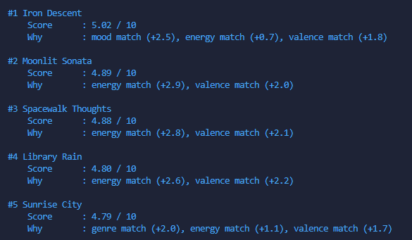
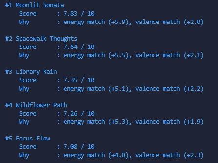

# 🎵 Music Recommender Simulation

## Project Summary

In this project you will build and explain a small music recommender system.

Your goal is to:

- Represent songs and a user "taste profile" as data
- Design a scoring rule that turns that data into recommendations
- Evaluate what your system gets right and wrong
- Reflect on how this mirrors real world AI recommenders

Replace this paragraph with your own summary of what your version does.

---

## How The System Works

Explain your design in plain language.

Some prompts to answer:

- What features does each `Song` use in your system
  - For example: genre, mood, energy, tempo
- What information does your `UserProfile` store
- How does your `Recommender` compute a score for each song
- How do you choose which songs to recommend

You can include a simple diagram or bullet list if helpful.

 Real recommendation systems aren't just a black and white sorting algorithm. Instead, it takes a lot of considerations, such as user preferences, popularity, genre, etc. It employs both a scoring and ranking system to not only get the matching number for the song, but also rank it based on factors such as alphabetically, relevance, popularity, etc. This is mostly content based filtering, where a user is given a recommendation based on the actual content, rather than widespread popularity. My version will prioritize energy, genre, mood and valence, as these are emotional states and preferences that is personal to the user.

 From Song and UserProfile we can implement the energy, valence, genre and mood features from the Song object, and the target_energy, favorite_genre and favorite_mood features from the UserProfile class. We will ignore the likes_acoustic, as a boolean is weak when it comes to preference.

 My finalized Algorithm recipe will be ranking based on genre, mood, energy, and valence. Since we need to score songs based on metrics, we will weigh each of these things seperately. Genre will be 4 points, mood will be 3 points, energy will be 2 points, and valence will be 1 point, for a total of 10. Most people resonate with genre the most, so it seems to be the best attribute to prioritize. However, while it is an important attribute, a genre still has a wide variety of songs and moods, and something in the genre may be less impactful than something outside the genre but with a similar mood. This bias will exist, but for general purposes, genre seems to be the best priority.
---

## Screenshot of Output:

---

## Getting Started

### Setup

1. Create a virtual environment (optional but recommended):

   ```bash
   python -m venv .venv
   source .venv/bin/activate      # Mac or Linux
   .venv\Scripts\activate         # Windows

2. Install dependencies

```bash
pip install -r requirements.txt
```

3. Run the app:

```bash
python -m src.main
```

### Running Tests

Run the starter tests with:

```bash
pytest
```

You can add more tests in `tests/test_recommender.py`.

---

## Experiments You Tried

Use this section to document the experiments you ran. For example:

- What happened when you changed the weight on genre from 2.0 to 0.5
- What happened when you added tempo or valence to the score
- How did your system behave for different types of users

User preference "genre": "pop", "mood": "sad", "energy": 0.8, "valence": 0.2:

User preference "genre": "lofi", "mood": "chill", "energy": 0.3, "valence": 0.6:

User preference "genre": "metal", "mood": "angry", "energy": 0.95, "valence": 0.2:



I then experimented to see the effect of weighting.
With normal weights: Profile: genre=pop, mood=angry, energy=0.2, valence=0.5


With a doubling of energy and halving of genre:


The second option wa sa lot worse, as Iron Descent was the only "angry" music, and a person with an angry profile getting Moonlit Sonata which is sad is completely off.
---

## Limitations and Risks

Summarize some limitations of your recommender.

Examples:

- It only works on a tiny catalog
- It does not understand lyrics or language
- It might over favor one genre or mood

You will go deeper on this in your model card.

---

## Reflection

Read and complete `model_card.md`:

[**Model Card**](model_card.md)

Write 1 to 2 paragraphs here about what you learned:

- about how recommenders turn data into predictions
- about where bias or unfairness could show up in systems like this


---

## 7. `model_card_template.md`

Combines reflection and model card framing from the Module 3 guidance. :contentReference[oaicite:2]{index=2}  

```markdown
# 🎧 Model Card - Music Recommender Simulation

## 1. Model Name

Give your recommender a name, for example:

> VibeFinder 1.0

---

## 2. Intended Use

- What is this system trying to do
- Who is it for

Example:

> This model suggests 3 to 5 songs from a small catalog based on a user's preferred genre, mood, and energy level. It is for classroom exploration only, not for real users.

---

## 3. How It Works (Short Explanation)

Describe your scoring logic in plain language.

- What features of each song does it consider
- What information about the user does it use
- How does it turn those into a number

Try to avoid code in this section, treat it like an explanation to a non programmer.

---

## 4. Data

Describe your dataset.

- How many songs are in `data/songs.csv`
- Did you add or remove any songs
- What kinds of genres or moods are represented
- Whose taste does this data mostly reflect

---

## 5. Strengths

Where does your recommender work well

You can think about:
- Situations where the top results "felt right"
- Particular user profiles it served well
- Simplicity or transparency benefits

---

## 6. Limitations and Bias

Where does your recommender struggle

Some prompts:
- Does it ignore some genres or moods
- Does it treat all users as if they have the same taste shape
- Is it biased toward high energy or one genre by default
- How could this be unfair if used in a real product

---

## 7. Evaluation

How did you check your system

Examples:
- You tried multiple user profiles and wrote down whether the results matched your expectations
- You compared your simulation to what a real app like Spotify or YouTube tends to recommend
- You wrote tests for your scoring logic

You do not need a numeric metric, but if you used one, explain what it measures.

---

## 8. Future Work

If you had more time, how would you improve this recommender

Examples:

- Add support for multiple users and "group vibe" recommendations
- Balance diversity of songs instead of always picking the closest match
- Use more features, like tempo ranges or lyric themes

---

## 9. Personal Reflection

A few sentences about what you learned:

- What surprised you about how your system behaved
- How did building this change how you think about real music recommenders
- Where do you think human judgment still matters, even if the model seems "smart"

